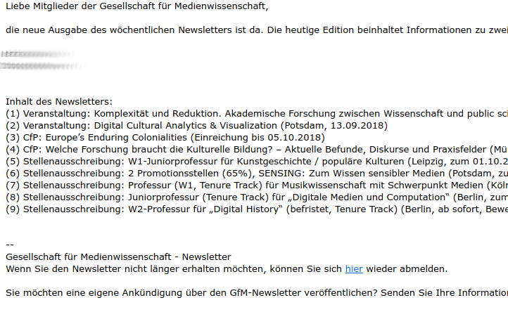

# gfm_newsletter
Daten und Code für meine Präsentation auf der Jahrestagung der [Gesellschaft für Medienwissenschaft (GfM)](https://gfmedienwissenschaft.de/) in Halle, 28.09.-01.10.2022

## Abstract

Die [Gesellschaft für Medienwissenschaft (GfM)](https://gfmedienwissenschaft.de/) verschickt in der Regel wöchentlich einen Newsletter an ihre Mitglieder. Dieser enthält Meldungen in den Kategorien "Call", "Veranstaltungen", "Stellenausschreibungen" u. a. mehr. Das macht den Newsletter zu einer Forschungsressource zur Entwicklung der Medienwissenschaft im deutschsprachigen Raum.  
Das Archiv der Newsletter 2015-2021 enthält rund 1000 Stellenanzeigen. Das Notebook hilft dabei, diese nach Datum, Standort, Stellenbeschreibung, Besoldungsgruppe auszuwerten. Auf diese Weise wird die Entwicklung von Stellen in der Medienwissenschaft im deutschsprachigen Raum untersuchbar. 
Das Vorgehen ist explorativ und dient der Veranschaulichung der aktuellen Möglichkeiten, aber auch der Grenzen von datenbasierter Forschung in der Medienwissenschaft.

## Screenshot Newsletter

## Notebook

Dieses Notebook nimmt Newsletter der Gesellschaft für Medienwissenschaft (GfM) und …
- erstellt ein Archiv der Mails, benannt nach dem Schema `YY-MM-DD.eml`
- sichert die PDF-Anhänge (`YYYY-MM-DD_Anhang.pdf`)
- erstellt die Tabelle `meldungen.csv` mit sämtlichen Newsletter-Einträgen
- erstellt die Tabelle `stellenanzeigen.csv` mit den Volltexten der Stellenanzeigens
- bietet Analysetools an

## Installation

Eine Anleitung zur [lokalen Installation von Jupyter Notebook](https://jupyter-notebook.readthedocs.io/en/latest/).
